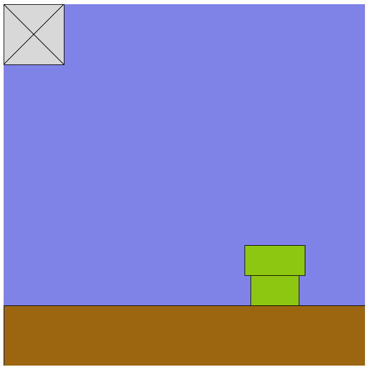

Super Mario Construction Kit

1) Change the code to make a better box

    var size = 100;
    fill(156,102,17);
    rect(0,0,size,size);
    line(0,0,size,size);
    line(size,0,0,size);

2) Change the code to position the box

    var x = 0;
    var y = 0;
    var size = 100;
    fill(156,102,17);
    rect(x,y,size,size);
    line(x,y,x+size,y+size);
    line(x+size,y,x,y+size);

3) Create a box function

    var box = function(x,y) {
        var size = 100;
        fill(156,102,17);
        rect(x,y,size,size);
        line(x,y,x+size,y+size);
        line(x+size,y,x,y+size);
    };

4) Draw the box

    box(0,0);

5) Draw a bunch of boxes

    box(100,200);
    box(200,200);
    box(300,200); 

6) Challenge: turn the pipe into a function and draw another pipe

7) Challenge: change your box to look different

8) Challenge: what can you add to your scene?